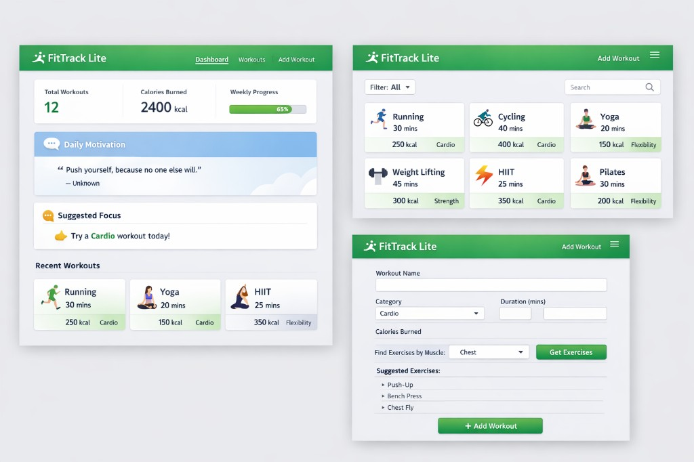

# FitTrack Lite

*A lightweight web portal for beginners who want to stay consistent with workouts—without the noise of full-featured fitness apps.*

## Project pitch

FitTrack Lite is a **niche fitness portal** built as a small, focused website. It is aimed at people who are just starting to exercise and need a calm, straightforward place to **explore workout ideas**, **see motivation or context from the web**, and **log what they did** in one session.

Heavy fitness apps often add dashboards, subscriptions, and social features before someone has built a habit. FitTrack Lite deliberately stays small: a few clear pages, a consistent visual style, and interactions that work on a phone or a laptop. The goal is to lower the barrier to **showing up again tomorrow**.

Implementation uses **semantic HTML**, **CSS** (including variables aligned with the mockup: greens, neutrals, motivation accent), and **vanilla JavaScript** for filtering, dynamic lists, form validation with **custom messages**, and `fetch()` for the motivation widget.

## User persona

**Alex — “The consistent beginner”**

- Wants to move more and build a routine without drowning in complex dashboards or paywalled apps.
- Likes seeing **simple numbers** (workout count, calories, weekly bar) and **what to do next** (workout cards).
- Uses **phone and laptop** and expects the layout to stay usable when the grid stacks on small screens.
- Success means **logging sessions regularly**, **browsing workouts confidently**, and **trusting** validation messages on the add form.

## Problem

Beginners often quit when tools feel like extra work:

- **No single calm home base** that combines motivation, quick stats, and recent activity.
- **Hard to explore** “what could I do?” without a visual library and fast filter/search.
- **Forms feel rigid**—no helpful structure (e.g. category, muscle-based suggestions) and no human-readable errors.

FitTrack Lite addresses this with a **dashboard + library + add** flow, a **card-based UI**, and validation that explains what to fix.

## Solution

Planned **multi-page** structure (three distinct views):

| View | File (planned) | Purpose |
|------|----------------|---------|
| **Dashboard** | `index.html` | Header/nav, stat cards, daily motivation (API), suggested focus, recent workouts |
| **Workouts** | `workouts.html` | Filter dropdown, search, responsive card grid (≥6 workouts), category tags |
| **Add Workout** | `add-workout.html` | Full form, muscle → suggested exercises (local JS data), submit with custom validation |

Shared **CSS variables** implement the mockup’s palette and spacing; **one complex responsive pattern** (e.g. workout grid: multi-column desktop → stacked mobile, and/or header/nav behavior) satisfies the rubric.

## Key features

| Feature | Description |
|--------|-------------|
| Dashboard | Stats (e.g. total workouts, calories, weekly progress bar), API-driven motivation block, suggestion strip, recent workout cards |
| Workouts gallery | ≥6 items as cards with icons/names/duration/calories/tags; **Filter** + **Search**; live filtering |
| Add Workout | Name, category, duration, calories; muscle selector + **Get Exercises** → suggested list; **+ Add Workout**; JS validation + custom errors |
| Live widget | `fetch()` from API Ninjas (e.g. quotes) in the Daily Motivation area; loading/error states |
| Responsive + semantic | Landmark structure; layout that **changes meaningfully** between mobile and desktop |

## Design reference

Low-fidelity / visual target for implementation:

*Source: project mockup (`docs/design-mockup.png`). Implementation may simplify icons or data while keeping layout and hierarchy.*

## Live demo

**Production URL:** _(add after deploy)_

**Repository:** _(optional public GitHub URL)_

## Tech stack

- HTML5, CSS3 (**custom properties** for theme colors)
- JavaScript (DOM, `fetch`, validation, local arrays / maps for workouts and muscle → exercises)
- Static hosting (Vercel / Netlify / GitHub Pages)
- [API Ninjas](https://api-ninjas.com/api) for Daily Motivation content (API key; see [NOTES.md](NOTES.md))

## Challenges & solutions

Document **at least one** concrete issue during build.

## Research

See **[NOTES.md](NOTES.md)** for palette notes, screen inventory, API choice, and implementation notes.

## Summary

A clean, modern FitTrack Lite experience: **dashboard** for motivation and progress, **workouts** for discovery, **add workout** for logging—with a unified green-and-card visual language.
